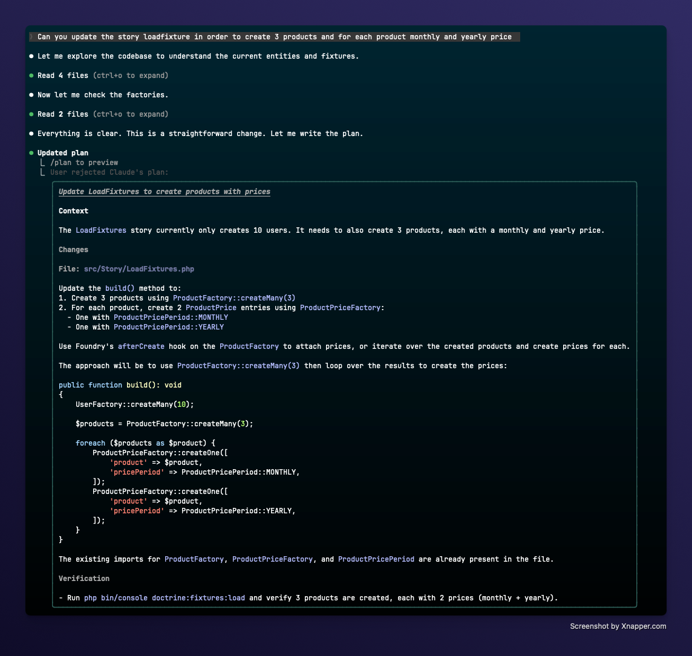
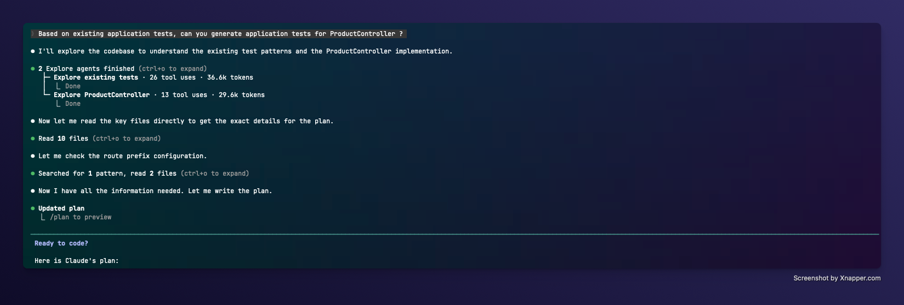

# AI Usage

AI was used during this project, here is what was done with it.

## Provider used : 

This project was done using PHPStorm IDE, which provide AI autocompletion.

Also, some parts where written by claude code, here is the list of the prompt used:

1. Update of foundry story to generate Product and ProductPrice fixtures: 

2. Application test generation for `ProductControllerTest`

